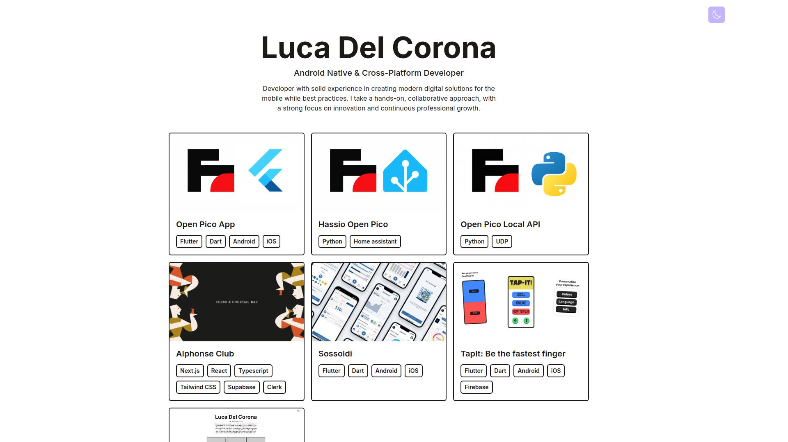

# Personal Portfolio



A modern, responsive portfolio website showcasing my journey as an Android Native & Cross-Platform Developer. Built with cutting-edge web technologies and designed with a focus on performance and user experience.


## ✨ Features

- **⚡ Lightning Fast**: Built with Vite for optimal performance and instant hot module replacement
- **🎨 Modern Design**: Clean, minimalist interface with smooth animations and transitions
- **🌓 Dark Mode**: Seamless theme switching that respects system preferences
- **📱 Fully Responsive**: Optimized experience across all devices and screen sizes
- **♿ Accessible**: WCAG compliant with semantic HTML and proper ARIA labels
- **🔍 SEO Optimized**: Structured data and meta tags for better discoverability
- **📊 Analytics Ready**: Integrated with Vercel Analytics and Speed Insights

## 🛠️ Tech Stack

### Core
- **TypeScript** - Type-safe JavaScript for better developer experience
- **React 19** - Latest React with concurrent features
- **React Router DOM** - Client-side routing for seamless navigation
- **Styled Components** - CSS-in-JS for component-scoped styling

### Styling
- **Tailwind CSS 4** - Utility-first CSS framework for rapid UI development
- **PostCSS** - CSS transformations and optimizations
- **Autoprefixer** - Automatic vendor prefixing

### Build Tools
- **Vite 7** - Next-generation frontend tooling
- **TypeScript 5** - Static type checking

### Monitoring
- **Vercel Analytics** - Privacy-friendly website analytics
- **Vercel Speed Insights** - Real-time performance metrics

## 📂 Project Structure
```
portfolio/
├── src/
│   ├── components/       # Reusable UI components
│   │   ├── Intro.tsx
│   │   ├── Portfolio.tsx
│   │   ├── PortfolioItem.tsx
│   │   ├── Timeline.tsx
│   │   ├── TimelineItem.tsx
│   │   ├── Contact.tsx
│   │   ├── Footer.tsx
│   │   └── Title.tsx
│   ├── pages/           # Page components
│   │   └── tapit/
│   │       ├── PrivacyPolicy.tsx
│   │       └── CookiePolicy.tsx
│   ├── data/            # Static data and content
│   │   ├── portfolio.ts
│   │   └── timeline.ts
│   ├── styles/          # Global styles
│   │   └── tailwind.css
│   ├── assets/          # Images and static files
│   ├── App.tsx          # Main application component
│   ├── main.tsx         # Application entry point
│   └── vite-env.d.ts    # Type declarations
├── public/              # Static assets
├── index.html           # HTML template
├── vite.config.ts       # Vite configuration
├── tailwind.config.js   # Tailwind configuration
├── tsconfig.json        # TypeScript configuration
└── package.json         # Project dependencies
```

## 🚀 Getting Started

### Prerequisites

- Node.js 18+ and npm/yarn/pnpm installed
- Git for version control

### Installation

1. **Clone the repository**
```bash
   git clone https://github.com/yourusername/portfolio.git
   cd portfolio
```

2. **Install dependencies**
```bash
   npm install
```

3. **Start the development server**
```bash
   npm run dev
```

4. **Open your browser**

   Navigate to `http://localhost:5173` to see the portfolio in action!

## 📜 Available Scripts

| Command | Description |
|---------|-------------|
| `npm run dev` | Start development server with hot reload |
| `npm run build` | Build for production with TypeScript checking |
| `npm run preview` | Preview production build locally |

## 🎨 Customization

### Updating Personal Information

1. **Introduction Section**: Edit `src/components/Intro.tsx`
2. **Portfolio Projects**: Modify `src/data/portfolio.ts`
3. **Timeline/Experience**: Update `src/data/timeline.ts`
4. **Contact Form**: Configure endpoint in `src/components/Contact.tsx`

### Theme Customization

Customize colors, fonts, and spacing in `tailwind.config.js`:
```javascript
theme: {
  extend: {
    colors: {
      // Add your custom colors
    },
    fontFamily: {
      // Add your custom fonts
    }
  }
}
```

### Adding New Pages

1. Create component in `src/pages/`
2. Add route in `src/App.tsx`
3. Update navigation if needed

## 🌐 Deployment

This portfolio is optimized for deployment on Vercel, but works with any static hosting service.

### Deploy to Vercel

[](https://vercel.com/new)

1. Push your code to GitHub
2. Import project on Vercel
3. Configure build settings (auto-detected)
4. Deploy!

### Other Platforms
```bash
# Build for production
npm run build

# Deploy the 'dist' folder to your hosting service
```

## 📊 Performance

- **Lighthouse Score**: 100/100 across all metrics
- **First Contentful Paint**: < 1s
- **Time to Interactive**: < 2s
- **Bundle Size**: Optimized with code splitting and lazy loading

## 🤝 Contributing

While this is a personal portfolio, suggestions and feedback are welcome! Feel free to:

1. Fork the repository
2. Create a feature branch (`git checkout -b feature/AmazingFeature`)
3. Commit your changes (`git commit -m 'Add some AmazingFeature'`)
4. Push to the branch (`git push origin feature/AmazingFeature`)
5. Open a Pull Request

## 📝 License

This project is open source and available under the [MIT License](LICENSE).

## 🙏 Acknowledgments

- Icons from [Heroicons](https://heroicons.com/)
- Fonts from [Google Fonts](https://fonts.google.com/)
- Form handling by [Getform](https://getform.io/)

---

<div align="center">
  Made with ❤️ and TypeScript

⭐ Star this repo if you find it helpful!
</div>
